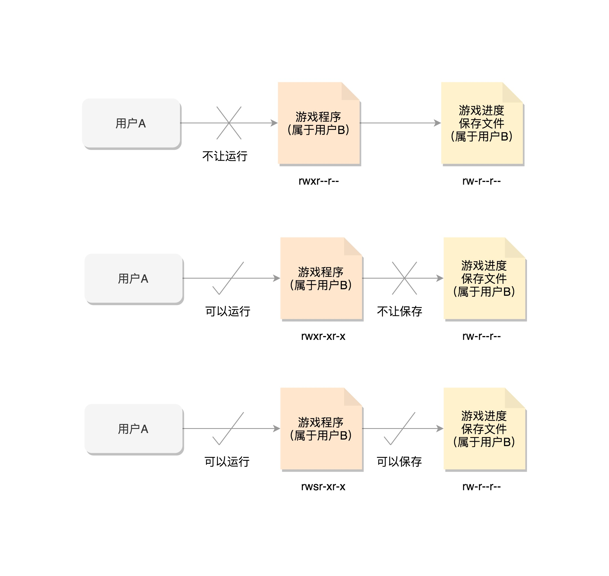
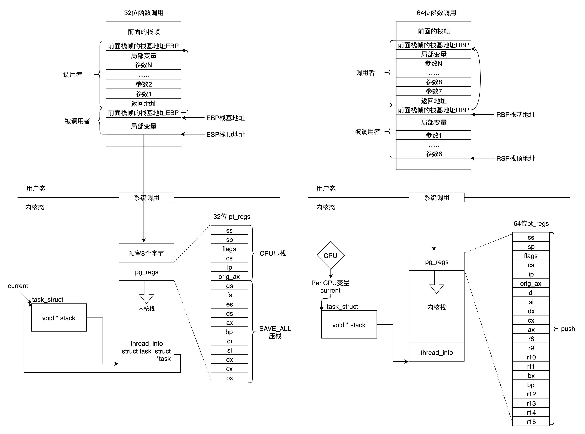

## 数据结构

```c
struct task_struct {
		// 将所有进程通过链表连接起来
		struct list_head		tasks;
  
/* 进程id */
    // 线程 id
		pid_t pid;
    // 主线程 id，如果 pid == tgid 表明当前为主线程
  	pid_t tgid;
    // 进程的主线程
  	struct task_struct *group_leader; 
  
/* 信号处理 */
    struct signal_struct    *signal;
    // 正在信号函数处理的
    struct sighand_struct    *sighand;
    // 阻塞不处理的信号
    sigset_t      blocked;
    // 
    sigset_t      real_blocked;
    sigset_t      saved_sigmask;
    // 等待处理的信号
    struct sigpending    pending;
    unsigned long      sas_ss_sp;
    size_t        sas_ss_size;
    unsigned int      sas_ss_flags;
  
/* 进程状态 */
    volatile long state;
    int exit_state;
    unsigned int flags;
  
/* 进程调度 */
    //是否在运行队列上
    int        on_rq;
    //优先级
    int        prio;
    int        static_prio;
    int        normal_prio;
    unsigned int      rt_priority;
    //调度器类
    const struct sched_class  *sched_class;
    //调度实体
    struct sched_entity    se;
    struct sched_rt_entity    rt;
    struct sched_dl_entity    dl;
    //调度策略
    unsigned int      policy;
    //可以使用哪些CPU
    int        nr_cpus_allowed;
    cpumask_t      cpus_allowed;
    struct sched_info    sched_info;  
  
/* 统计信息 */
    u64        utime;//用户态消耗的CPU时间
    u64        stime;//内核态消耗的CPU时间
    unsigned long      nvcsw;//自愿(voluntary)上下文切换计数
    unsigned long      nivcsw;//非自愿(involuntary)上下文切换计数
    u64        start_time;//进程启动时间，不包含睡眠时间
    u64        real_start_time;//进程启动时间，包含睡眠时间 
  
/* 进程亲缘关系 */
    struct task_struct __rcu *real_parent; /* real parent process */
    struct task_struct __rcu *parent; /* recipient of SIGCHLD, wait4() reports */
    struct list_head children;      /* list of my children */
    struct list_head sibling;       /* linkage in my parent's children list */  
  
/* 权限相关 */
    /* Objective and real subjective task credentials (COW): */
    const struct cred __rcu         *real_cred;
    /* Effective (overridable) subjective task credentials (COW): */
    const struct cred __rcu         *cred;  
  
/* 内存管理 */
    struct mm_struct                *mm;
    struct mm_struct                *active_mm;
  
/* 文件系统 */
    /* Filesystem information: */
    struct fs_struct                *fs;
    /* Open file information: */
    struct files_struct             *files;
  
/* 线程栈 */
    struct thread_info    thread_info;
    void  *stack;  
}
```


### 进程状态 state

```c
// 只要有时间片就可以执行
#define TASK_RUNNING                    0
#define TASK_INTERRUPTIBLE              1
// 处于这种状态的信号，不响应中断，kill 也无法处理，只能重启
#define TASK_UNINTERRUPTIBLE            2
// 进程接收到 SIGSTOP、SIGTTIN、SIGTSTP 或者 SIGTTOU 信号之后进入该状态。
#define __TASK_STOPPED                  4
// 进程被 debugger 等进程监视，进程执行被调试程序所停止
#define __TASK_TRACED                   8

// exit_state
#define EXIT_DEAD                       16
// 如果父进程显式忽略子进程的退出信号的话，子进程退出时是不会进入EXIT_ZOMBIE
#define EXIT_ZOMBIE                     32
#define EXIT_TRACE                      (EXIT_ZOMBIE | EXIT_DEAD)  

#define TASK_DEAD                       64
#define TASK_WAKEKILL                   128
#define TASK_WAKING                     256
#define TASK_PARKED                     512
#define TASK_NOLOAD                     1024
#define TASK_NEW                        2048
#define TASK_STATE_MAX                  4096   

/* Convenience macros for the sake of set_current_state: */
#define TASK_KILLABLE			(TASK_WAKEKILL | TASK_UNINTERRUPTIBLE)
#define TASK_STOPPED			(TASK_WAKEKILL | __TASK_STOPPED)
#define TASK_TRACED			(TASK_WAKEKILL | __TASK_TRACED)
#define TASK_IDLE			(TASK_UNINTERRUPTIBLE | TASK_NOLOAD)
/* Convenience macros for the sake of wake_up(): */
#define TASK_NORMAL			(TASK_INTERRUPTIBLE | TASK_UNINTERRUPTIBLE)
/* get_task_state(): */
#define TASK_REPORT			(TASK_RUNNING | TASK_INTERRUPTIBLE | \
					 TASK_UNINTERRUPTIBLE | __TASK_STOPPED | \
					 __TASK_TRACED | EXIT_DEAD | EXIT_ZOMBIE | \
					 TASK_PARKED)
```


### 进程 flag

```c
/*
 * Per process flags
 */
#define PF_IDLE			0x00000002	/* I am an IDLE thread */
// 当有这个 flag 的时候，在函数 find_alive_thread 中，找活着的线程，遇到有这个 flag 的，就直接跳过。
#define PF_EXITING		0x00000004	/* Getting shut down */
#define PF_EXITPIDONE		0x00000008	/* PI exit done on shut down */
// 在函数 account_system_time 中，统计进程的系统运行时间，如果有这个 flag，就调用 account_guest_time，按照客户机的时间进行统计。
#define PF_VCPU			0x00000010	/* I'm a virtual CPU */
#define PF_WQ_WORKER		0x00000020	/* I'm a workqueue worker */
// 在 _do_fork 函数里面调用 copy_process，这个时候把 flag 设置为 PF_FORKNOEXEC。当 exec 中调用了 load_elf_binary 的时候，又把这个 flag 去掉。
#define PF_FORKNOEXEC		0x00000040	/* Forked but didn't exec */
#define PF_MCE_PROCESS		0x00000080      /* Process policy on mce errors */
#define PF_SUPERPRIV		0x00000100	/* Used super-user privileges */
#define PF_DUMPCORE		0x00000200	/* Dumped core */
#define PF_SIGNALED		0x00000400	/* Killed by a signal */
#define PF_MEMALLOC		0x00000800	/* Allocating memory */
#define PF_NPROC_EXCEEDED	0x00001000	/* set_user() noticed that RLIMIT_NPROC was exceeded */
#define PF_USED_MATH		0x00002000	/* If unset the fpu must be initialized before use */
#define PF_USED_ASYNC		0x00004000	/* Used async_schedule*(), used by module init */
#define PF_NOFREEZE		0x00008000	/* This thread should not be frozen */
#define PF_FROZEN		0x00010000	/* Frozen for system suspend */
#define PF_KSWAPD		0x00020000	/* I am kswapd */
#define PF_MEMALLOC_NOFS	0x00040000	/* All allocation requests will inherit GFP_NOFS */
#define PF_MEMALLOC_NOIO	0x00080000	/* All allocation requests will inherit GFP_NOIO */
#define PF_LESS_THROTTLE	0x00100000	/* Throttle me less: I clean memory */
#define PF_KTHREAD		0x00200000	/* I am a kernel thread */
#define PF_RANDOMIZE		0x00400000	/* Randomize virtual address space */
#define PF_SWAPWRITE		0x00800000	/* Allowed to write to swap */
#define PF_MEMSTALL		0x01000000	/* Stalled due to lack of memory */
#define PF_UMH			0x02000000	/* I'm an Usermodehelper process */
#define PF_NO_SETAFFINITY	0x04000000	/* Userland is not allowed to meddle with cpus_allowed */
#define PF_MCE_EARLY		0x08000000      /* Early kill for mce process policy */
#define PF_MEMALLOC_NOCMA	0x10000000	/* All allocation request will have _GFP_MOVABLE cleared */
#define PF_FREEZER_SKIP		0x40000000	/* Freezer should not count it as freezable */
#define PF_SUSPEND_TASK		0x80000000      /* This thread called freeze_processes() and should not be frozen */

#define PF_EXITING    0x00000004
#define PF_VCPU      0x00000010
#define PF_FORKNOEXEC    0x00000040
```


### 用户权限

```c

struct cred {
......
        kuid_t          uid;            /* real UID of the task */
        kgid_t          gid;            /* real GID of the task */
        kuid_t          suid;           /* saved UID of the task */
        kgid_t          sgid;           /* saved GID of the task */
        kuid_t          euid;           /* effective UID of the task */
        kgid_t          egid;           /* effective GID of the task */
        kuid_t          fsuid;          /* UID for VFS ops */
        kgid_t          fsgid;          /* GID for VFS ops */
......
        kernel_cap_t    cap_inheritable; /* caps our children can inherit */
        kernel_cap_t    cap_permitted;  /* caps we're permitted */
        kernel_cap_t    cap_effective;  /* caps we can actually use */
        kernel_cap_t    cap_bset;       /* capability bounding set */
        kernel_cap_t    cap_ambient;    /* Ambient capability set */
......
} __randomize_layout;
```


#### SUID 机制

* uid/gid(哪个用户的进程启动我)

*  euid/egid(按照哪个用户审核权限, 操作消息队列, 共享内存等)

*  fsuid/fsgid(文件操作时审核)


   

这三组 id 一般一样

通过 chmod u+s program, 给程序设置 set-user-id 标识位, 运行时程序将进程 euid/fsuid 改为程序文件所有者 id

suid/sgid 可以用来保存 id, 进程可以通过 setuid 更改 uid




### capabilities 机制

cap_permitted 表示进程的权限
cap_effective 实际起作用的权限, cap_permitted 范围可大于 cap_effective
cap_inheritable 若权限可被继承, 在 exec 执行时继承的权限集合, 并加入 cap_permitted 中(但非 root 用户不会保留 cap_inheritable 集合)
cap_bset 所有进程保留的权限(限制只用一次的功能)
cap_ambient exec 时, 并入 cap_permitted 和 cap_effective 中


### 函数栈


在用户态，应用程序进行了至少一次函数调用。32 位和 64 的传递参数的方式稍有不同，32 位的就是用函数栈，64 位的前 6 个参数用寄存器，其他的用函数栈。

在内核态，32 位和 64 位都使用内核栈，格式也稍有不同，主要集中在 pt_regs 结构上。在内核态，32 位和 64 位的内核栈和 task_struct 的关联关系不同。32 位主要靠 thread_info，64 位主要靠 Per-CPU 变量。




## 思考题

信号处理函数到底是在哪个线程中运行的？

进程状态变成zombie后，他在等父进程调用wait() 来回收自己的空间是么？所以在回收完他的空间后他就彻底进入了EXIT_DEAD状态是么？可是为什么top命令下的S 栏里面没有dead这个状态，而只有R,S,D,T,Z这五个？
另外在进程收到SIGTERM或者SIGKILL这样terminate类的信号时，进程也是进入了EXIT_DEAD状态么？


